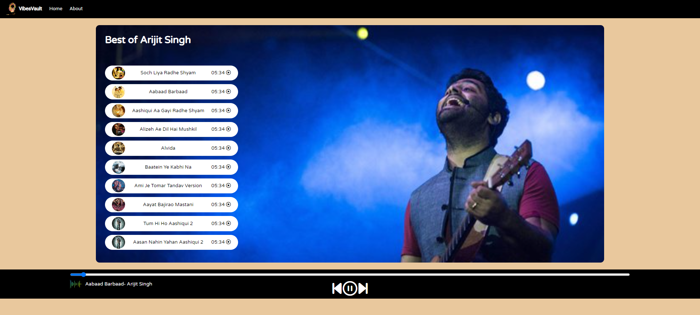

# VibesVault - Vibe with Music 🎵

Welcome to VibesVault, a simple and stylish music player website developed using pure HTML, CSS, and JavaScript. With VibesVault, you can easily play your favorite music, skip forward and backward, all in a sleek and intuitive interface.



## Features 🚀

- **Play Your Music**: Upload your favorite songs and start playing them instantly.

- **Skip Forward and Backward**: Easily navigate through your playlist with the simple navigation controls.

- **Sleek Design**: VibeVault sports a modern and minimalist design that focuses on what matters most - your music.

- **Responsive**: Whether you're on a computer, tablet, or phone, VibeVault looks and works great on all devices.

## Demo 🎉

Check out VibeVault in action [here](https://your-vibevault-website-link.com)!

## Getting Started 🏁

1. Clone this repository to your local machine using:

   ```bash
   git clone https://github.com/MrAkash920/VibesVault.git
   ```

2. Open the `index.html` file in your favorite web browser.

3. Start adding your favorite music and enjoy the vibes!

## How to Use 🎶

1. **Adding Music**: Click on the "Add Music" button to upload your music files.

2. **Play/Pause**: Click the play button to start playing your music. Click it again to pause.

3. **Skip Forward/Backward**: Use the forward and backward buttons to navigate through your playlist.

4. **Volume Control**: Adjust the volume using the slider control.

5. **Enjoy the Music**: Sit back, relax, and enjoy your favorite tunes!

## Contributing 🤝

We welcome contributions from the community to make VibeVault even better! Feel free to open issues, submit pull requests, or suggest new features.

## License 📝

This project is licensed under the MIT License - see the [LICENSE](LICENSE) file for details.

## Acknowledgements 🙏

- Special thanks to [Name of an Artist] for the awesome music used in this demo.

## Contact Us 📧

If you have any questions, suggestions, or just want to chat about music, feel free to reach out to us at [snghakashcu@gmail.com](mailto:singhakashcu@gmail.com).

## Stay in the Groove with VibeVault! 🎧🕺

VibeVault is here to make your music experience enjoyable and hassle-free. Give it a try and turn up the volume on your music vibes today!

[](https://github.com/MrAkash920/VibesVault/stargazers)

*Made with ❤️ by [Your Name]*